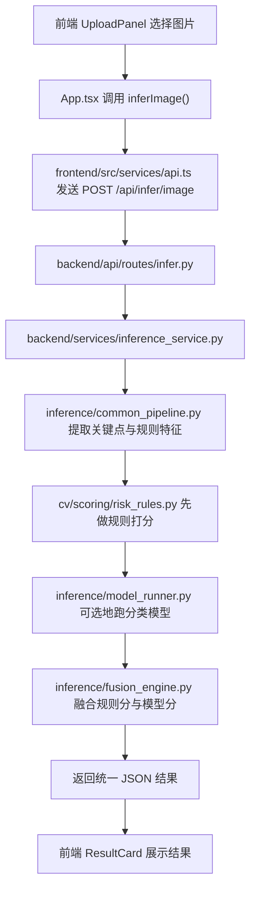

# 驾驶员疲劳检测项目新手导读

## 1. 这个项目是做什么的

这是一个“驾驶员疲劳与分心检测”演示项目。

它的目标不是只做一个分类模型，而是把一个完整的小型 AI 应用链路串起来：

1. 前端页面接收用户上传的图片或视频
2. 后端接口接收文件
3. 推理模块提取人脸特征并进行风险判断
4. 规则法和轻量模型的结果被融合
5. 前端把检测结果、训练指标、风险等级展示出来

如果你是第一次接触项目开发，可以把它理解成：

- `frontend/` 负责“给人看”
- `backend/` 负责“接请求、回结果”
- `cv/` 和 `inference/` 负责“真正做检测”
- `training/` 负责“训练模型”
- `configs/` 负责“集中管理阈值和参数”

这个项目比较适合学习“一个 AI 功能怎么被做成可运行的小系统”。

## 2. 先看整体结构

项目顶层目录可以先这样理解：

```text
疲劳驾驶检测/
├── backend/        # FastAPI 后端服务
├── frontend/       # React 前端页面
├── cv/             # 传统视觉特征提取与规则打分
├── inference/      # 统一推理管线与规则/模型融合
├── training/       # 分类模型训练与评估
├── configs/        # 阈值、融合规则、运行参数
├── scripts/        # 数据准备脚本
├── tests/          # 测试
├── data/           # 数据目录
├── outputs/        # 推理输出
└── docs/           # 文档
```

第一次看这种项目，不要一开始就逐行读代码。正确顺序是：

1. 先看“系统由哪些模块组成”
2. 再看“用户的一次操作会经过哪些文件”
3. 最后才看“某个函数具体怎么写”

## 3. 用一句话理解每个核心目录

### `frontend/`

这是用户直接看到的网页界面。  
它负责：

- 展示系统标题和服务状态
- 上传图片和视频
- 调用后端接口
- 展示推理结果和训练指标

入口文件：

- [App.tsx](C:/Users/Xia%20chuan%20can/Desktop/疲劳驾驶检测/frontend/src/App.tsx)
- [api.ts](C:/Users/Xia%20chuan%20can/Desktop/疲劳驾驶检测/frontend/src/services/api.ts)

### `backend/`

这是后端服务，使用 FastAPI。  
它负责：

- 暴露 HTTP 接口
- 接收上传的图片和视频
- 调用推理服务
- 把结果整理成统一 JSON 返回给前端

入口文件：

- [main.py](C:/Users/Xia%20chuan%20can/Desktop/疲劳驾驶检测/backend/main.py)
- [infer.py](C:/Users/Xia%20chuan%20can/Desktop/疲劳驾驶检测/backend/api/routes/infer.py)
- [inference_service.py](C:/Users/Xia%20chuan%20can/Desktop/疲劳驾驶检测/backend/services/inference_service.py)

### `cv/`

这是传统计算机视觉部分。  
它负责从人脸关键点中提取一些可解释特征，比如：

- EAR：眼睛张开程度
- MAR：嘴巴张开程度
- 头部 yaw / pitch / roll：偏头、低头、转头角度

这些特征会进一步用于规则判断。

关键文件：

- [eye_features.py](C:/Users/Xia%20chuan%20can/Desktop/疲劳驾驶检测/cv/features/eye_features.py)
- [mouth_features.py](C:/Users/Xia%20chuan%20can/Desktop/疲劳驾驶检测/cv/features/mouth_features.py)
- [head_pose.py](C:/Users/Xia%20chuan%20can/Desktop/疲劳驾驶检测/cv/features/head_pose.py)
- [risk_rules.py](C:/Users/Xia%20chuan%20can/Desktop/疲劳驾驶检测/cv/scoring/risk_rules.py)

### `inference/`

这是“推理总控层”，也是这个项目最核心的地方之一。  
它负责把多个来源的信息串起来：

- 传统视觉规则
- 分类模型预测
- 离线图片推理
- 离线视频逐帧推理
- 实时帧推理

关键文件：

- [common_pipeline.py](C:/Users/Xia%20chuan%20can/Desktop/疲劳驾驶检测/inference/common_pipeline.py)
- [fusion_engine.py](C:/Users/Xia%20chuan%20can/Desktop/疲劳驾驶检测/inference/fusion_engine.py)
- [model_runner.py](C:/Users/Xia%20chuan%20can/Desktop/疲劳驾驶检测/inference/model_runner.py)

### `training/`

这是训练轻量分类模型的地方。  
它负责：

- 读取训练/验证数据
- 构建模型
- 训练
- 计算准确率、F1、混淆矩阵
- 保存最优权重和训练日志

关键文件：

- [train_classifier.py](C:/Users/Xia%20chuan%20can/Desktop/疲劳驾驶检测/training/train_classifier.py)
- [eval_classifier.py](C:/Users/Xia%20chuan%20can/Desktop/疲劳驾驶检测/training/eval_classifier.py)

### `configs/`

这是项目的“参数控制台”。  
很多行为并不是写死在代码里的，而是由配置控制。

比如：

- 闭眼阈值
- 打哈欠阈值
- 低头/转头持续多少帧才算风险
- 规则分和模型分怎么融合

关键文件：

- [mvp.yaml](C:/Users/Xia%20chuan%20can/Desktop/疲劳驾驶检测/configs/mvp.yaml)

## 4. 一次图片检测是怎么跑通的

如果你上传一张图片，大致流程如下：



这里你要注意一个很重要的工程思想：

这个项目没有把“API、特征提取、模型预测、分数融合、页面展示”写在一个文件里，而是拆成了多层。  
这样做的好处是后面更容易维护，也更容易替换某一层。

## 5. 一次视频检测是怎么跑通的

视频检测和图片检测思路相似，但多了“逐帧循环”和“事件汇总”：

1. 前端上传视频
2. 后端逐帧读取视频
3. 每一帧进入统一推理管线
4. 每一帧都得到疲劳分和分心分
5. 后端统计：
   - 成功帧数
   - 失败帧数
   - 平均风险分
   - 峰值风险等级
   - 连续事件列表
6. 前端展示摘要结果

也就是说，视频模式不是“把视频一次性丢给模型”，而是“逐帧分析，再做汇总”。

## 6. 这个项目为什么要同时用规则法和模型法

这是这个项目最值得学习的地方。

### 规则法

规则法主要依赖人工定义的阈值和时序逻辑，例如：

- 眼睛连续闭合超过若干帧，判定疲劳风险上升
- 嘴巴张开超过阈值，且持续一定帧数，判定打哈欠
- 头部持续转向或低头，判定分心风险

优点：

- 容易解释
- 容易调试
- 不依赖大模型

缺点：

- 对复杂情况适应性有限
- 阈值比较依赖经验

### 模型法

模型法使用训练好的分类器，对图像或人脸区域做类别概率预测，例如：

- `normal`
- `eye_closed`
- `yawn`
- `distracted`

优点：

- 对复杂视觉模式更敏感
- 能补充规则法的不足

缺点：

- 不如规则法直观
- 依赖训练数据和模型质量

### 融合法

项目没有简单地“二选一”，而是把两者结合。

你可以理解为：

- 规则法负责提供稳定、可解释的基础判断
- 模型法负责在关键场景里加分、减分、纠偏

这个逻辑主要在 [fusion_engine.py](C:/Users/Xia%20chuan%20can/Desktop/疲劳驾驶检测/inference/fusion_engine.py) 中实现。

## 7. 你应该重点读哪些文件

如果你是第一次做项目，不建议全部文件从头读到尾。建议按下面顺序：

### 第一轮：先看系统入口

1. [main.py](C:/Users/Xia%20chuan%20can/Desktop/疲劳驾驶检测/backend/main.py)
2. [App.tsx](C:/Users/Xia%20chuan%20can/Desktop/疲劳驾驶检测/frontend/src/App.tsx)
3. [api.ts](C:/Users/Xia%20chuan%20can/Desktop/疲劳驾驶检测/frontend/src/services/api.ts)

看完这三处，你会知道：

- 前端怎么发请求
- 后端暴露了哪些接口
- 系统最外层长什么样

### 第二轮：看业务主线

1. [infer.py](C:/Users/Xia%20chuan%20can/Desktop/疲劳驾驶检测/backend/api/routes/infer.py)
2. [inference_service.py](C:/Users/Xia%20chuan%20can/Desktop/疲劳驾驶检测/backend/services/inference_service.py)
3. [common_pipeline.py](C:/Users/Xia%20chuan%20can/Desktop/疲劳驾驶检测/inference/common_pipeline.py)
4. [fusion_engine.py](C:/Users/Xia%20chuan%20can/Desktop/疲劳驾驶检测/inference/fusion_engine.py)

看完这四处，你会知道：

- 图片和视频请求怎样进入系统
- 推理结果怎样生成
- 规则分和模型分怎样融合

### 第三轮：看底层能力

1. [risk_rules.py](C:/Users/Xia%20chuan%20can/Desktop/疲劳驾驶检测/cv/scoring/risk_rules.py)
2. [mvp.yaml](C:/Users/Xia%20chuan%20can/Desktop/疲劳驾驶检测/configs/mvp.yaml)
3. [train_classifier.py](C:/Users/Xia%20chuan%20can/Desktop/疲劳驾驶检测/training/train_classifier.py)

看完这三处，你会知道：

- 风险分数具体怎么来的
- 阈值怎么调
- 训练模块如何独立工作

## 8. 关键文件到底分别干什么

### [main.py](C:/Users/Xia%20chuan%20can/Desktop/疲劳驾驶检测/backend/main.py)

这是后端应用入口。

它做的事很少，但很关键：

- 创建 FastAPI 应用
- 配置 CORS
- 注册路由

这说明项目在后端层面是“入口清晰，业务下沉”的设计。

### [infer.py](C:/Users/Xia%20chuan%20can/Desktop/疲劳驾驶检测/backend/api/routes/infer.py)

这是图片和视频检测接口层。

它的职责不是“自己做检测”，而是：

- 接收上传文件
- 读取表单参数
- 调用服务层
- 返回标准响应

这是一个很好的分层写法。  
对新手来说，你可以记住一句话：

> 路由层负责“接电话”，服务层负责“干活”。

### [inference_service.py](C:/Users/Xia%20chuan%20can/Desktop/疲劳驾驶检测/backend/services/inference_service.py)

这是后端最重要的业务编排层之一。

它负责：

- 保存上传文件
- 读取图片或视频
- 调用统一推理管线
- 调用融合引擎
- 处理离线图片、视频、实时帧三种模式
- 整理成统一返回结构

如果你只能选一个后端文件重点读，这个优先级非常高。

### [common_pipeline.py](C:/Users/Xia%20chuan%20can/Desktop/疲劳驾驶检测/inference/common_pipeline.py)

这是“单帧推理”的基础管线。

它做的事包括：

- 用 MediaPipe 提取人脸关键点
- 计算 EAR、MAR、头部姿态
- 维护时序状态
- 调用规则打分器
- 输出一个结构化的单帧结果

你可以把它理解成：

> 先把一帧图像转换成“可判断的结构化信息”。

### [risk_rules.py](C:/Users/Xia%20chuan%20can/Desktop/疲劳驾驶检测/cv/scoring/risk_rules.py)

这是规则评分器。

它并不关心前端、后端、上传文件这些东西，它只关心：

- 当前帧的眼睛、嘴巴、头姿信号
- 连续多少帧出现异常
- 最终应该给多少疲劳分、多少分心分

这种“只专注一件事”的模块设计，是值得学习的。

### [fusion_engine.py](C:/Users/Xia%20chuan%20can/Desktop/疲劳驾驶检测/inference/fusion_engine.py)

这是融合引擎。

它负责把：

- 规则法结果
- 模型概率
- 离线/实时不同模式

综合成统一风险输出。

这个文件体现了项目的核心思想：  
**不是盲信模型，也不是只靠规则，而是做融合决策。**

### [train_classifier.py](C:/Users/Xia%20chuan%20can/Desktop/疲劳驾驶检测/training/train_classifier.py)

这是训练脚本入口。

它会：

- 加载配置
- 构建数据集和 DataLoader
- 训练模型
- 计算指标
- 保存 `best.pt` 和训练日志

这部分对理解“模型是怎么来的”很重要，但它不是线上推理主链路的入口。

## 9. 这个项目的设计优点

从新手视角看，这个项目有几个明显优点：

1. 分层清楚  
前端、后端、推理、训练、规则、配置基本分开了。

2. 功能链路完整  
不仅有模型，还有接口、页面、结果展示和训练指标。

3. 规则和模型结合  
这比单纯做一个分类器更接近真实业务。

4. 配置集中  
很多阈值放在 YAML 中，更方便调参和实验。

5. 响应结构统一  
图片、视频、实时推理都尽量走统一的数据结构。

## 10. 对新手来说最容易卡住的地方

### 1. 一上来就读训练代码

训练代码通常很长，第一次看容易迷路。  
建议先理解“系统怎么用”，再理解“模型怎么训练”。

### 2. 分不清“规则分”和“最终风险分”

这里至少有三层概念：

- 原始视觉特征：EAR、MAR、yaw、pitch
- 规则打分：疲劳分、分心分
- 融合输出：结合模型概率后的最终结果

不要把它们混为一谈。

### 3. 以为前端是重点

这个项目的前端比较薄，主要是展示和请求封装。  
真正的核心在后端推理链路和融合逻辑。

### 4. 以为模型是全部

在这个项目里，模型只是系统的一部分，不是全部。  
真正值得学的是“如何把模型接入一个完整应用”。

## 11. 推荐你的阅读路线

如果你是第一次做项目，我建议你花 2 到 3 轮阅读：

### 第 1 轮：只求看懂“系统在干什么”

- 看本文件
- 看 [App.tsx](C:/Users/Xia%20chuan%20can/Desktop/疲劳驾驶检测/frontend/src/App.tsx)
- 看 [main.py](C:/Users/Xia%20chuan%20can/Desktop/疲劳驾驶检测/backend/main.py)
- 看 [infer.py](C:/Users/Xia%20chuan%20can/Desktop/疲劳驾驶检测/backend/api/routes/infer.py)

目标：知道系统从哪里进、从哪里出。

### 第 2 轮：看懂“结果怎么产生”

- 看 [inference_service.py](C:/Users/Xia%20chuan%20can/Desktop/疲劳驾驶检测/backend/services/inference_service.py)
- 看 [common_pipeline.py](C:/Users/Xia%20chuan%20can/Desktop/疲劳驾驶检测/inference/common_pipeline.py)
- 看 [risk_rules.py](C:/Users/Xia%20chuan%20can/Desktop/疲劳驾驶检测/cv/scoring/risk_rules.py)
- 看 [fusion_engine.py](C:/Users/Xia%20chuan%20can/Desktop/疲劳驾驶检测/inference/fusion_engine.py)

目标：知道风险结果不是凭空来的。

### 第 3 轮：看懂“模型和训练怎么补进来”

- 看 [train_classifier.py](C:/Users/Xia%20chuan%20can/Desktop/疲劳驾驶检测/training/train_classifier.py)
- 看 [metrics_service.py](C:/Users/Xia%20chuan%20can/Desktop/疲劳驾驶检测/backend/services/metrics_service.py)
- 看 [TrainingMetricsPanel.tsx](C:/Users/Xia%20chuan%20can/Desktop/疲劳驾驶检测/frontend/src/components/TrainingMetricsPanel.tsx)

目标：知道训练成果如何进入展示页面。

## 12. 最后给新手的一句话

第一次看项目时，不要追求“全部看懂”，要先追求“主线清楚”。

对这个仓库来说，你只要先弄清楚下面这句话，就已经超过很多第一次做项目的人了：

> 用户在前端上传文件，后端接收文件后调用统一推理管线，先做规则分析，再参考分类模型结果进行融合，最后把统一风险结果返回给前端展示。

当你把这句话和代码对应起来，这个项目的大致思路就已经通了。
